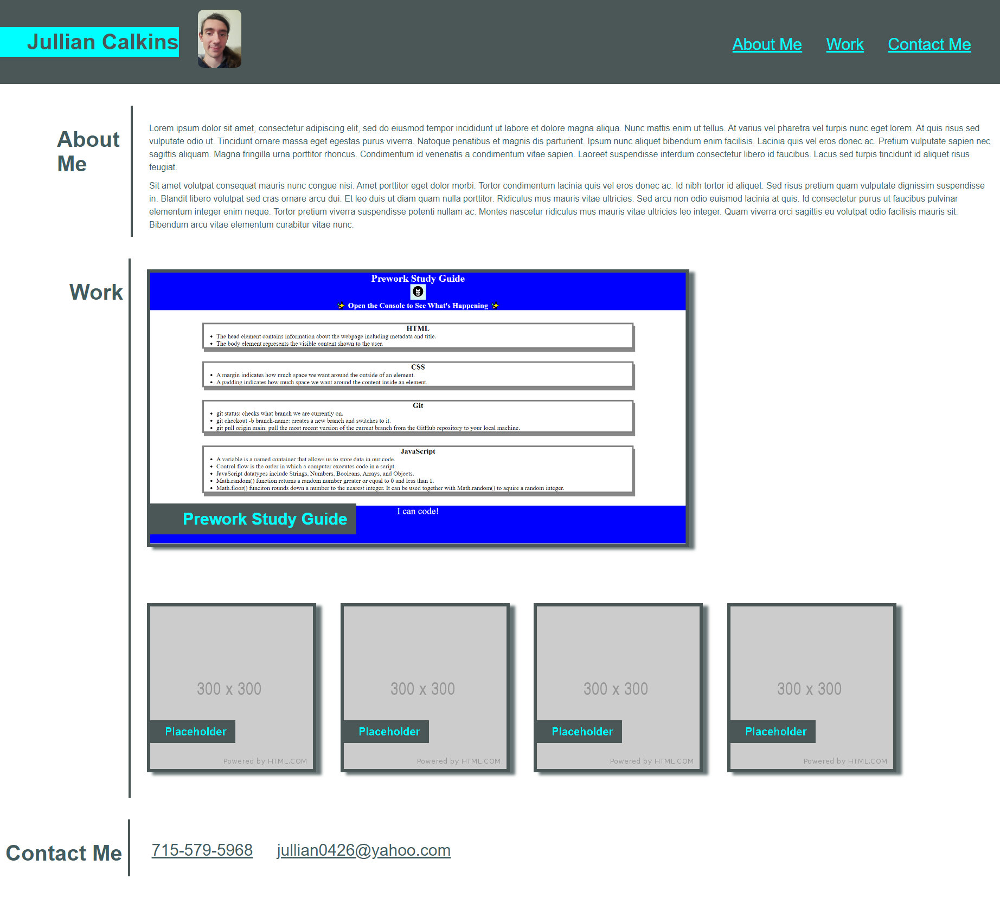

# Professional Portfolio

## Description

This website is a portfolio where I will later display my work to potential employers. By building this website I further practiced semantic html element usage and became more familiar with css styling and positioning, specifically through the use of flexboxes. It also served as practice creating a mock-up design for a website and coding it from scratch.

## Installation

N/A

## Usage

Click this link to be sent to the deployed website. https://jullian0426.github.io/Professional-Portfolio/

## Credits

N/A

## License

N/A